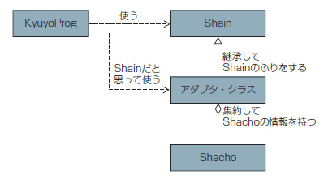

Adapter
===

## 目的

- 本来つながらないクラス同士をつなげる。

## 背景(問題)

SalaryProgクラスのgetSalary(Employee employee)メソッドは  
EmployeeクラスのgetHourlyWage()とgetWorkingHours()を使用し給与を計算するとする。  

SalaryProgでPressidentクラスのメンバは、固定給の値を返すgetFixedSalary()メソッドだけになっている。

このままでは、SalaryProgクラスのgetSalary(Employee employee)を利用できない。

## 効果

- プログラムを修正することなく機能を追加することができる。

## 概要

Adapter(接続装置)パターンは、見かけ上はEmployeeクラスだが、その中身にPressidentクラスを含めているという
［アダプタクラス］を作るというもの。

実現方法としてAdapterクラスはEmployeeクラスを継承し、Pressidentクラスのオブジェクトを集約し、内包すれば実現できる。

以上
