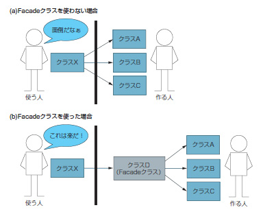

Facade
===

## 目的

- 使いやすいクラスを設計する。

## 背景(問題)

- オブジェクト指向プログラミングにおいては、［クラスを作る(設計する)人］と［クラスを使用する人］の  
二つの役割が存在する。

- クラスA,B,Cという名前の3つのクラスを作成した時に、クラスを使用する人は3つのクラスを使用する必要がある。

- 3つのクラスを使用するクラスDを作成すれば、クラスを使用する人は1つのクラスを使用すればよくなる。

- 複数人でプログラムを効率的に作成するには、[思いやり] が必要なのである。

## 効果

- 設計したクラスの使用方法が簡単になる。

## 概要

以上
