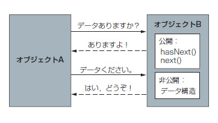

Iterator
===

## 目的

- オブジェクトのデータ構造を意識することなく処理を行いたい。

## 背景(問題)

オブジェクト指向プログラミングにおいて、モジュールはそれ自体で完結すべきである。  
あるオブジェクトA内の配列をオブジェクトBで利用するときに、  
オブジェクトBはオブジェクトAがもつ、配列の中身を知る必要があるため、  
オブジェクト間の関係が複雑になってしまう。  

## 効果

- オブジェクト同士の関係をシンプルにすることができる。

## 概要

下記のプログラムを考えてみる。

	Class Main{
	
		public static void main(String args[]){
	
			ClassA classA=new ClassA:
				ClassB classB=new ClassB:
	
				ClassB.printArray(ClassA.integerArray.length);
		}
	}
	
	Class ClassA{
	
		public int[] integerArray= new int[10];
	}
	
	Class ClassB{
		public void printArray(int max){
			for(int index=0; index < max ; index++){
				System.out.println(index);
			}
		}
	}

この場合、ClassAの配列を利用するために、ClassBはClassAの配列の構造を
知る必要が出てきてしまう。

この問題を解決するのが、Iterationパターンである。

Iterationパターンを利用した場合、オブジェクトBは、オブジェクトAの配列の構造を知る必要はなくなり  
［次の項目が存在するかどうか？］という情報を取得しながら処理を記述すればよくなる。S

以上
