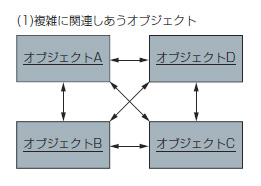
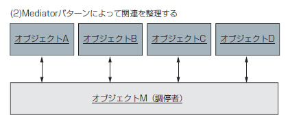

Medicatorパターン
===

## 目的

- 複数のオブジェクトを組み合わせてプログラムの機能を実現する

## 背景(問題)

- オブジェクト間の関連がゴチャゴチャになってしまうという背景

## 効果

- オブジェクト同士の関連をキレイに整理できる

## 概要

上図のようなオブジェクト同士の関係だと、ある一つのプログラムを改造した場合。    
関連する他のオブジェクトにも影響を与える為、それぞれテストが必要になる。  
  
この問題の原因は、オブジェクト間の関連が複雑すぎることである。  
  
そこで、オブジェクトの調停者となるオブジェクトMを追加する。  

こうすることによって、例えばオブジェクトAのプログラムを改造したときも、  
オブジェクトMのプログラムを改造するだけで機能を担保することができる。

以上
